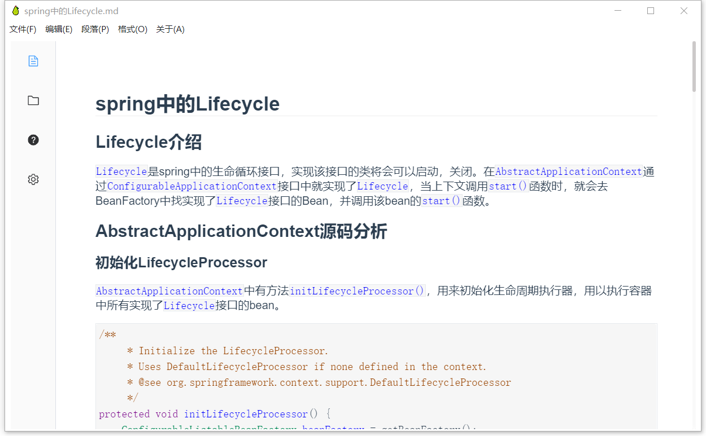
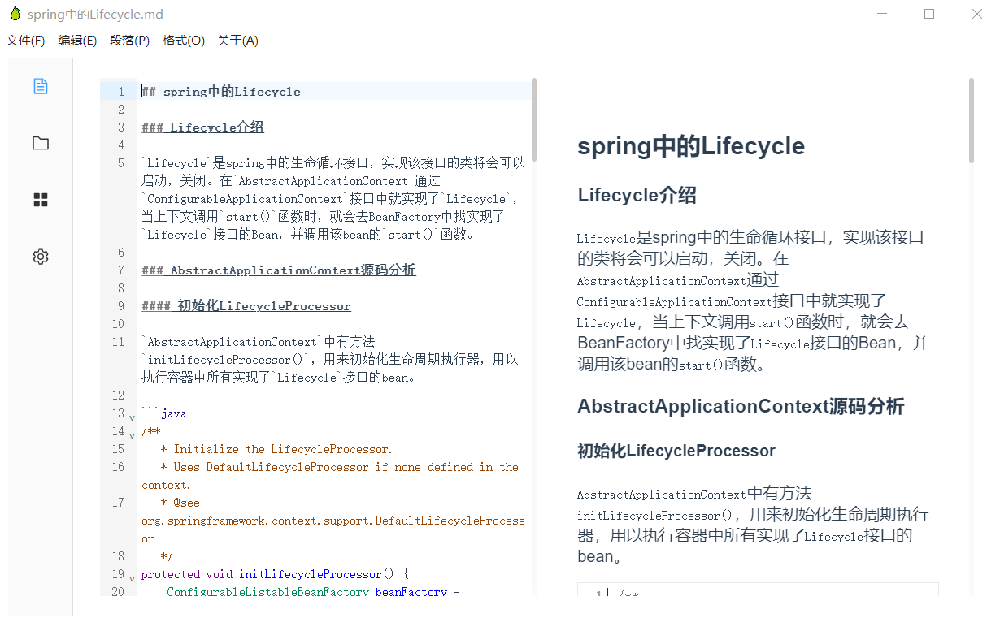
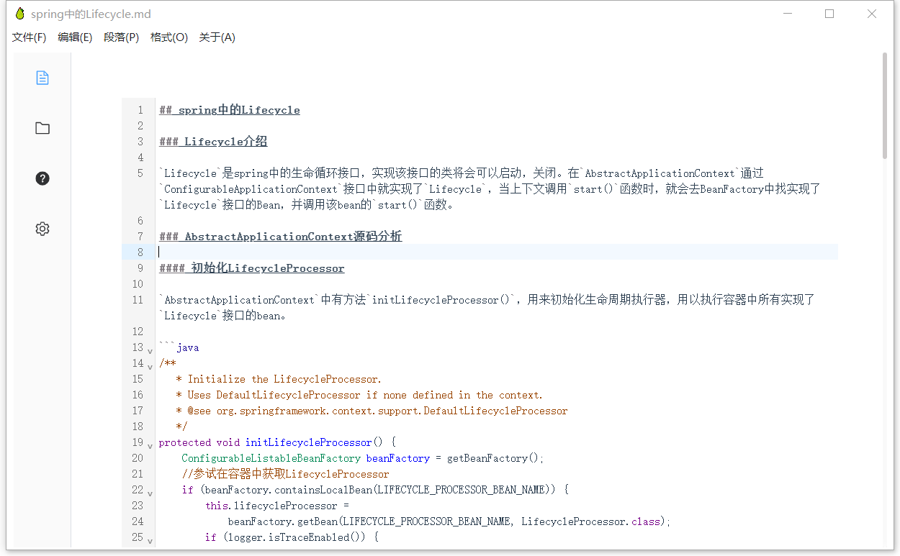
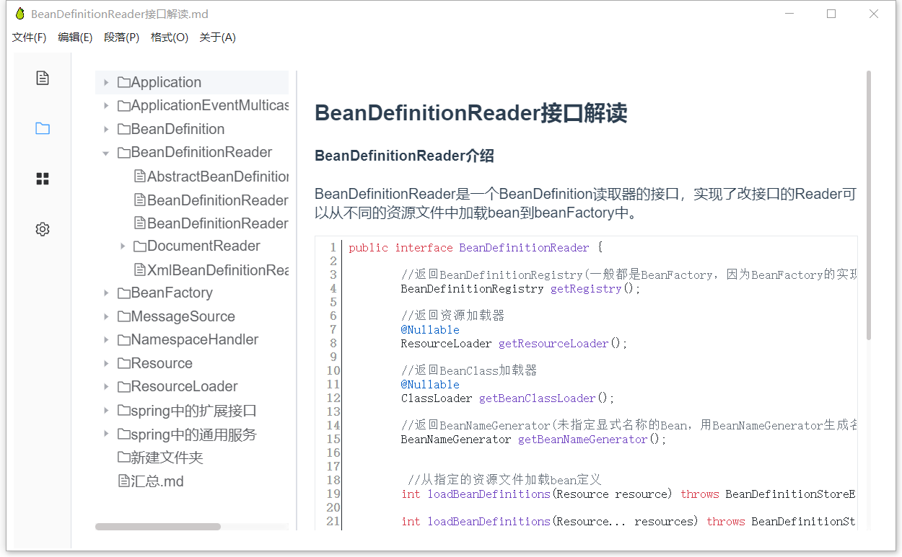
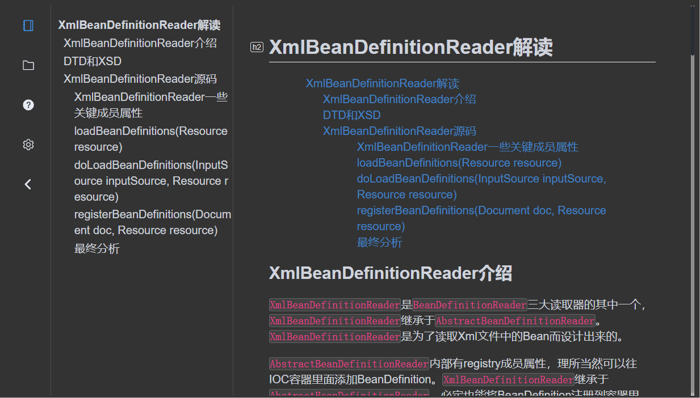
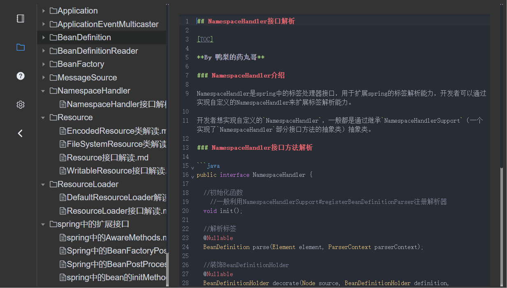

<p align="center">
 
 <h2 align="center">YaliEditor</h2>
 <p align="center">A simple real-time rendering markdown editor!</p>
</p>
  <p align="center">
    <a href="https://github.com/anuraghazra/github-readme-stats/issues">
      
    </a>
    <a href="https://github.com/anuraghazra/github-readme-stats/pulls">
      
    </a>
    <br />
  </p>
  <p align="center">
    <a href="#demo">View Demo</a>
    ·
    <a href="https://github.com/WenyaoL/YaliEditor/issues/new/choose">Report Bug</a>
    ·
    <a href="https://github.com/WenyaoL/YaliEditor/issues/new/choose">Request to add functions</a>
  </p>
  <p align="center">
    <a href="/README.md">English</a>
    ·
    <a href="/docs/README_CN.md">简体中文</a>
  </p>

<p align="center">This project is still in the development stage! Like this project? Please suggest your needs to help it improve!
</p>

# YaliEditor

- [YaliEditor](#yalieditor)
  - [Download and Install](#download-and-install)
  - [Introduction](#introduction)
    - [IR real-time rendering mode](#ir-real-time-rendering-mode)
    - [SV split screen mode](#sv-split-screen-mode)
    - [Only source code mode](#only-source-code-mode)
    - [Folder Preview](#folder-preview)
    - [Theme](#theme)
    - [Support export](#support-export)
    - [Render Support](#render-support)
    - [Shortcut key](#shortcut-key)
  - [Project setup](#project-setup)
    - [Help](#help)

## Download and Install

Download address：[Releases · WenyaoL/YaliEditor (github.com)](https://github.com/WenyaoL/YaliEditor/releases)

Support window 64-bit

Support Window 32-bit


## Introduction

YaliEditor is a lightweight real-time rendering markdown editor that supports markdown pure code mode, SV split screen mode, and IR real-time rendering mode.

### IR real-time rendering mode



### SV split screen mode



### Only source code mode



### Folder Preview



### Theme

Themes now support light and dark modes





### Support export

- Support pdf export

- Support png format image export

- Support html export

### Render Support

Support rendering code block and mathematical formula block.

The code block implementation uses codemirror 6, which supports syntax highlighting in multiple languages. Support syntax highlighting switch.

### Shortcut key

About -->Help Documents

*   `Ctrl+1`：一级标题
    
*   `Ctrl+2`：二级标题
    
*   `Ctrl+3`：三级标题
    
*   `Ctrl+4`：四级标题
    
*   `Ctrl+5`：五级标题
    
*   `Ctrl+6`：六级标题
    
*   `Ctrl+B`：加粗
    
*   `Ctrl+I`：斜体
    
*   `Ctrl+U`：下滑线
    
*   `Ctrl+]`：增加缩进
    
*   `Ctrl+[`：减少缩进
    
*   `Ctrl+Shift+%`：删除线
    
*   `Ctrl+Shift+~`：代码引用
    
*   `Ctrl+Shift+K`：代码块
    
*   `Ctrl+Shift+M`：数学公式

*   `Ctrl+Shift+H`：HTML编辑块
    
*   `Ctrl+Shift+Q`：引用
    
*   `Ctrl+Shift+[`：有序列表
    
*   `Ctrl+Shift+]`：无序列表
    
*   `Ctrl+Shift+T`：创建目录

## Project setup

```shell
#clone project
git clone git@github.com:WenyaoL/YaliEditor.git

#install
npm run install

#build
npm run electron:build
```


### Help

我也不想当乞丐，但是我实在是太穷了，求求各位大哥，V我1块钱，就当是可怜可怜我

I don't want to be a beggar, but I'm really too poor. I beg you, brothers, to help me, just take pity on me


###other

技术提问,+Q:835946631,+q群:215169418
Java，Vue前端等问题都可以找我，我有时间会立刻答复