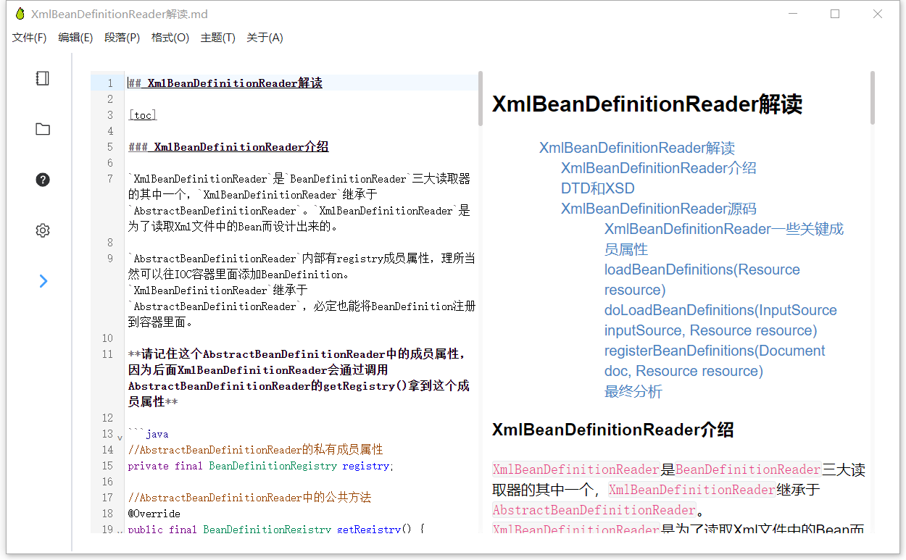

<p align="center">
 
 <h2 align="center">YaliEditor</h2>
 <p align="center">A simple real-time rendering markdown editor!</p>
</p>
  <p align="center">
    <a href="https://github.com/anuraghazra/github-readme-stats/issues">
      
    </a>
    <a href="https://github.com/anuraghazra/github-readme-stats/pulls">
      
    </a>
    <br />
  </p>
  <p align="center">
    <a href="#demo">View Demo</a>
    ·
    <a href="https://github.com/WenyaoL/YaliEditor/issues/new/choose">Report Bug</a>
    ·
    <a href="https://github.com/WenyaoL/YaliEditor/issues/new/choose">Request to add functions</a>
  </p>
  <p align="center">
    <a href="/README.md">English</a>
    ·
    <a href="/docs/README_CN.md">简体中文</a>
  </p>

<p align="center">This project is still in the development stage! Like this project? Please suggest your needs to help it improve!
</p>

# YaliEditor

- [Download and Install](#download-and-install)

- [Introduction](#Introduction)
  
  - [IR real-time rendering mode](#ir-real-time-rendering-mode)
  
  - [SV split screen mode](#sv-split-screen-mode)
  
  - [Only source code mode](#only-source-code-mode)
  
  - [Folder Preview](#folder-Preview)
  
  - [Project setup](#project-setup)

## Download and Install

Install address：[Releases · WenyaoL/YaliEditor (github.com)](https://github.com/WenyaoL/YaliEditor/releases)

Support window 64-bit

Support Window 32-bit

## Introduction

YaliEditor is a lightweight real-time rendering markdown editor that supports markdown pure code mode, SV split screen mode, and IR real-time rendering mode.

**The project is still in the development stage**

### Thinking about using virtual nodes to transform the rendering of the editor

In the process of updating, I have been thinking about whether to separate the editor's editing state and abstract the editor's text state into a tree like data structure. When the user changes the content of the text, the editor should modify the data structure of the text state, modify the response text information with more modified nodes, and then re render the editor page through the virtual node technology through the data structure of the text state to realize the presentation and update of the data.

This rendering method is significantly safer and easier to maintain than the current version of the editor. All editing behaviors of the current version of the editor are directly acting on the dom node of the editor panel, which is not the safest operation method. It is possible that the illegal operation method of the user will cause the document to generate a dom structure that cannot be processed, which will cause the editor to have configuration errors and translation errors of markdown syntax.

### IR real-time rendering mode


### SV split screen mode



### Only source code mode


### Folder Preview


### Project setup

```shell
#clone project
git clone git@github.com:WenyaoL/YaliEditor.git

#install
npm run install

#build
npm run electron:build
```
