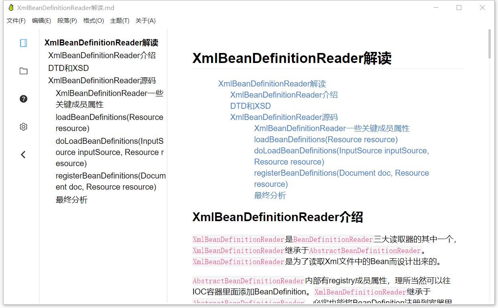
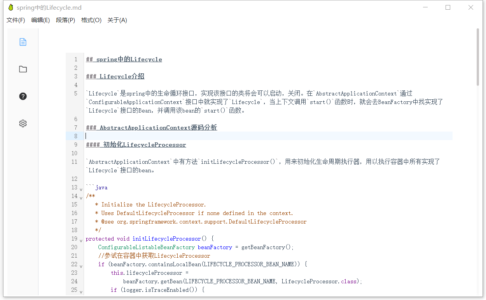
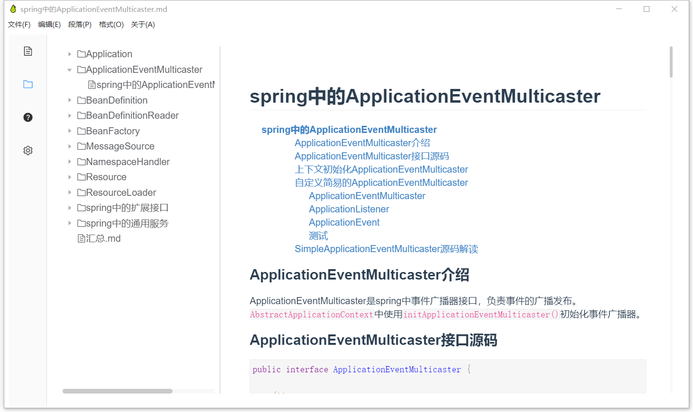

<p align="center">
 
 <h2 align="center">YaliEditor</h2>
 <p align="center">A simple real-time rendering markdown editor!</p>
</p>
  <p align="center">
    <a href="https://github.com/anuraghazra/github-readme-stats/issues">
      
    </a>
    <a href="https://github.com/anuraghazra/github-readme-stats/pulls">
      
    </a>
    <br />
  </p>
  <p align="center">
    <a href="#demo">View Demo</a>
    ·
    <a href="https://github.com/WenyaoL/YaliEditor/issues/new/choose">Report Bug</a>
    ·
    <a href="https://github.com/WenyaoL/YaliEditor/issues/new/choose">Request to add functions</a>
  </p>
  <p align="center">
    <a href="/README.md">English</a>
    ·
    <a href="/docs/README_CN.md">简体中文</a>
  </p>

<p align="center">This project is still in the development stage! Like this project? Please suggest your needs to help it improve!
</p>

# YaliEditor

- [介绍](#介绍)
  
  - [IR实时渲染模式](#IR实时渲染模式)
  
  - [SV分屏模式](#SV分屏模式)
  
  - [Only源代码模式](#Only源代码模式)
  
  - [文件夹预览](#文件夹预览)
  
  - [Project setup](#project-setup)

## 介绍

YaliEditor是一款轻量级的实时渲染markdown编辑器，支持markdown纯代码模式，SV分屏模式，和IR实时渲染模式。

**该项目还处于开发阶段**

### 关于使用虚拟节点去改造编辑器的渲染的思考

在更新的过程中，一直在思考，是否应该将编辑器的编辑状态进行抽离，将编辑器的文本状态抽象成一种树状的数据结构。当用户去更改文本的内容时，编辑器应该去修改文本状态的数据结构，更具修改的节点去修改响应的文本信息，然后再通过文本状态的数据结构去通过虚拟Node的技术，重新渲染编辑器页面，实现数据的展现更新。

这种渲染方法明显比现在的版本的编辑器来得更加安全，并且更加易于维护。现版本的编辑器的所有编辑行为，都是直接作用在编辑器面板的dom节点上的，并不是最安全的操作方法，有可能因为用户的违法操作方法会导致document生成无法处理的dom结构，导致编辑器出现渲染错误和翻译markdown语法翻译错误的问题。

### IR实时渲染模式



### SV分屏模式


### Only源代码模式



### 文件夹预览



## Project setup

```shell
#clone project
git clone git@github.com:WenyaoL/YaliEditor.git

#install
npm run install

#build
npm run electron:build
```
